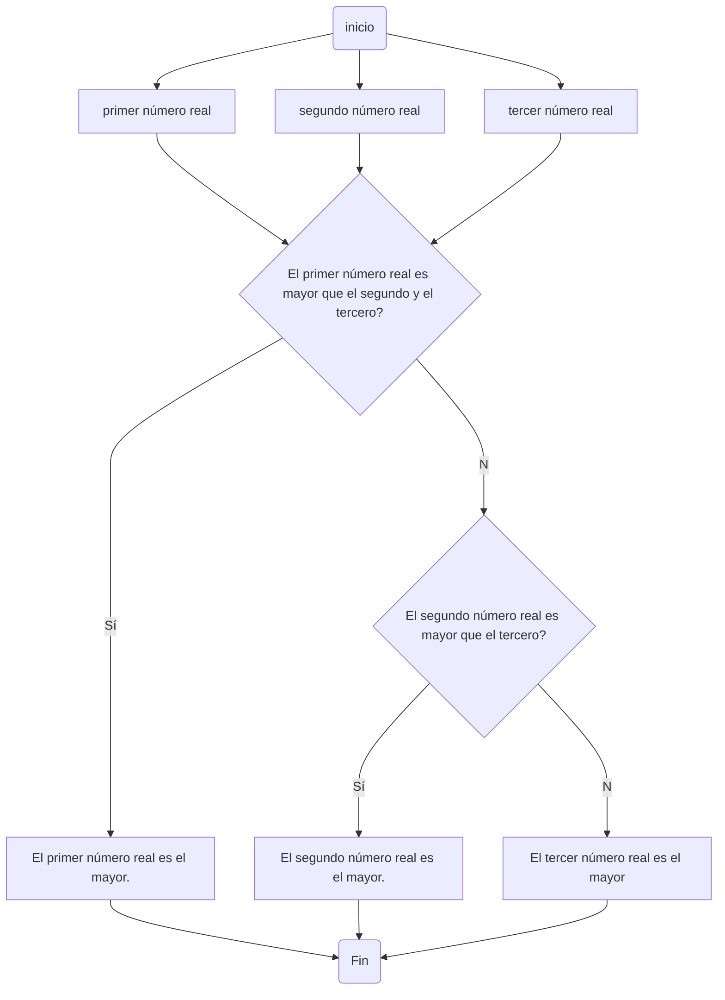
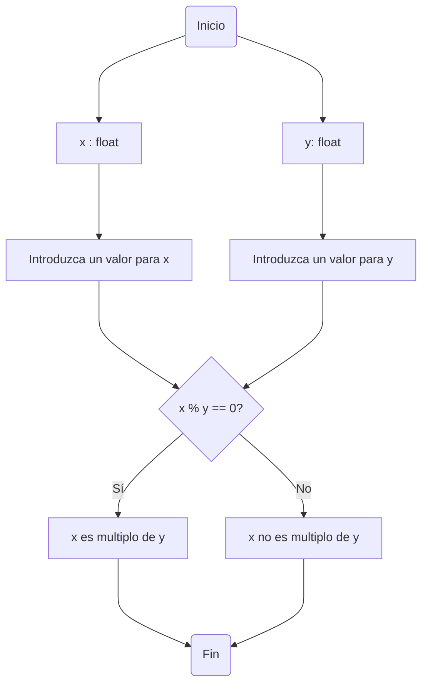

# Taller 1

### Nombre del grupo:
# Agrocode industry

Integrantes:
* Paula Jiménez Quiñones
* Mario Alejandro Martinez
* David Rodriguez Rueda

## Primer punto


## Segundo punto
Realice un programa que lea tres números reales y determine cuál es el mayor.

**Diagrama de flujo**

## Tercer punto


## Cuarto punto

### Problema planteado:
Realice un programa que lea dos números reales y determine si el primero es múltiplo del segundo.

### La solución del problema es la siguiente:
1. Lo primero que se hizo fue declarar las variables como números flotantes.
2. Seguido a esto inicializamos las variables que van a ser número ingresados por las personas que estén utilizando el programa.
3. Después condicionamos de la siguiente forma
   * Si x % y == 0 entonces, x es multiplo de y.
   * Sino entonces x no es multiplo de y.

Y de esta manera fue solucionado el problema incialmente planteado.

##### El código del rpoblema es el siguiente:
```
#declaramos variables
x : float
y : float
#inicializamos variables
print("Comprobaremos si x es multiplo de y")
x = float(input("Introduzca un valor para x: "))
y = float(input("Introduzca un valor para y: "))
#condicionamos
if x % y == 0:
    print(x, "es multiplo de", y)
else:
    print(x, "no es multiplo", y)
```

##### El diagrama de flujo representando la solución del problema es el siguiente:


## Quinto punto


## Sexto punto


## Séptimo punto


## Octavo punto

### Problema planteado:
Escriba un programa al que se le ingrese la frecuencia de una onda en hz y como salida arroje en que parte del espectro electromagnético se encuentra.

### Solución del problema:
1. Se declara variable que en este caso sería: hz. Esta variable puede ser un flotante.
2. La inicialización de la variable va a ser un número que introduzca el sujeto que esté utilizando el programa.
3. Después de esto condicionamos teniendo en cuenta que hay varias áreas del espectro electromagnético.
   * Iniciamos con la condición if, si el número ingresado por la persona está en el campo ingresado por esta persona saldría un mensaje sobre cual es el espectro electromagnético
   * Como hay muchas más condiciones en las cuales las ondas pueden estar en otras áreas del espectro electromagnético entonces se usa elif para cada una de ellas.
   * El uso de else lo utilizaremos para la última área del espectro electromagnético que vamos a tener en cuanta según la frecuencia.

Y de esta manera se solucionaría el problema planteado

##### El código de la solución del problema es el siguiente:
```
#Cual es el problema a abordar?
print("¿En que espectro electromagnético está la onda en hertz?")
#Declaramos variables
hz : float
#Inicializamos variable
hz = float(input("Ingrese los hertz que usted estime para una onda(se recomienda en notación cientifica): "))
#Condicionamos
if hz <= 30e4:
    print("Cuando la frecuencia de la honda es de", hz, "hertz, la onda tiene un espectro electromagnético de frecuencias extremadamente bajas")
elif 30e4 < hz <= 30e9:
    print("Cuando la frecuencia de la honda es de", hz, "hertz, la onda tiene un espectro electromagnético de tipo: Radio")
elif 30e9 < hz <= 30e11:
    print("Cuando la frecuencia de la honda es de", hz, "hertz, la onda tiene un espectro electromagnético de tipo: Microondas")
elif 30e11 < hz <= 30e14:
    print("Cuando la frecuencia de la honda es de", hz, "hertz, la onda tiene un espectro electromagnético de tipo: Infrarrojo")
elif 30e14 < hz <= 30e15:
    print("Cuando la frecuencia de la honda es de", hz, "hertz, la onda tiene un espectro electromagnético visible para el ojo humano")
elif 30e15 < hz <= 30e16:
    print("Cuando la frecuencia de la honda es de", hz, "hertz, la onda tiene un espectro electromagnético de tipo: Ultravioleta")
elif 30e16 < hz <= 30e20:
    print("Cuando la frecuencia de la honda es de", hz, "hertz, la onda tiene un espectro electromagnético de tipo: Rayos X")
elif 30e20 < hz <= 30e21:
    print("Cuando la frecuencia de la honda es de", hz, "hertz, la onda tiene un espectro electromagnético de tipo: Rayos Gamma")
else:
    print("Cuando la frecuencia de la honda es de", hz, "hertz, la onda tiene un espectro electromagnético de tipo: Rayos cósmicos")
```

## Noveno punto


## Décimo punto


