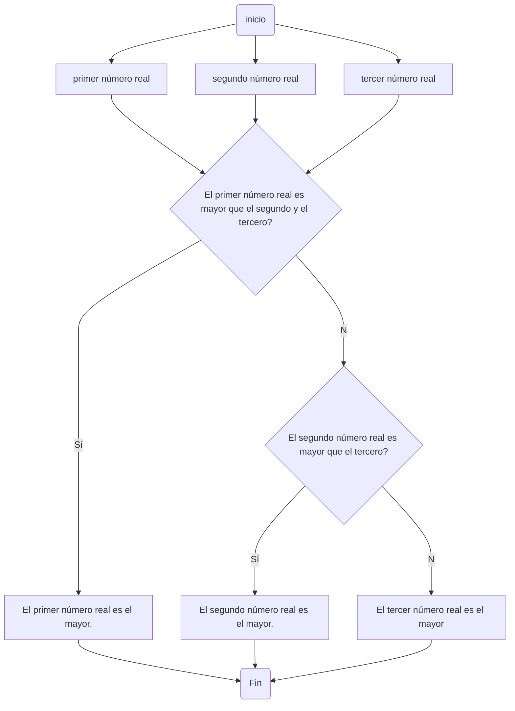

# Taller 1

Nombre del grupo: Agrocode industry

Integrantes: Paula Jiménez Quiñones, Mario Alejandro Martinez y David Rodriguez Rueda

## Primer punto

## Segundo punto
Realice un programa que lea tres números reales y determine cuál es el mayor.

**Diagrama de flujo**

## Tercer punto

## Cuarto punto

## Quinto punto

## Sexto punto

## Séptimo punto

## Octavo punto

## Noveno punto

## Décimo punto

