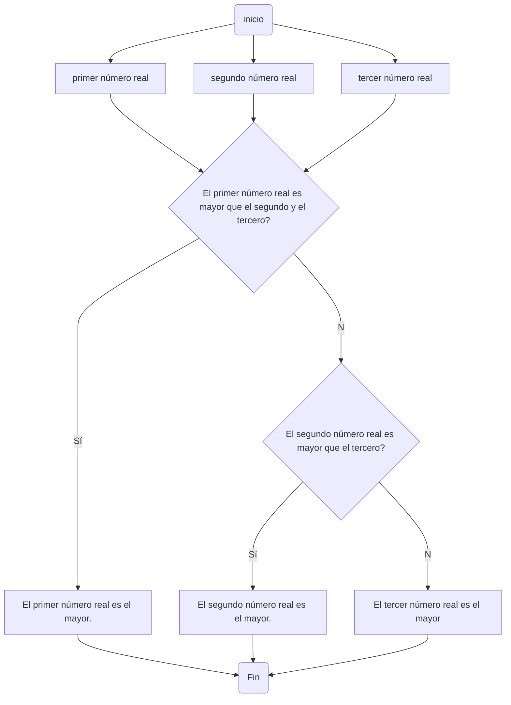
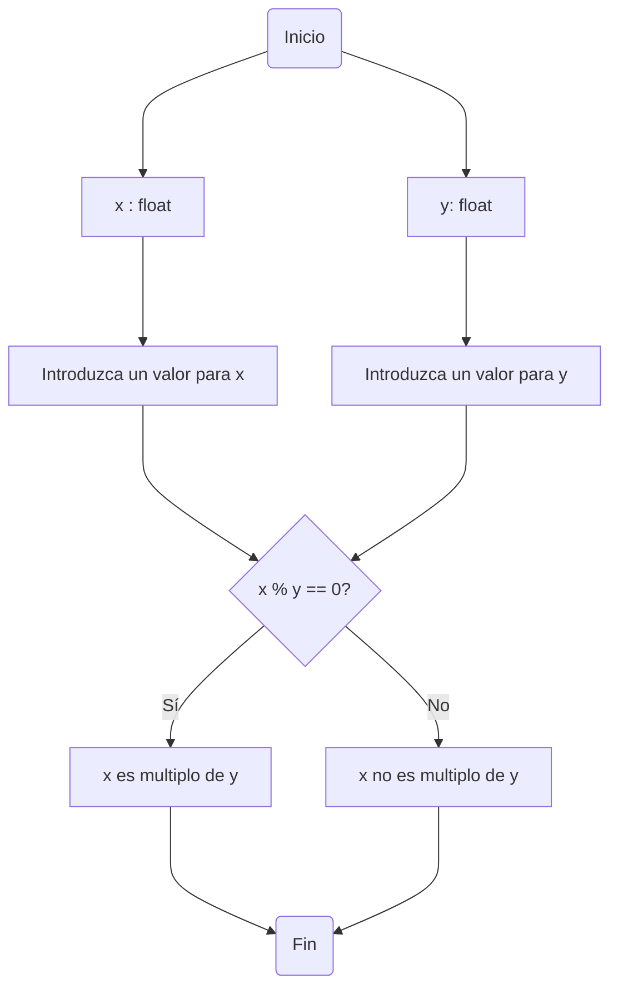

# Taller 1

### Nombre del grupo:
# Agrocode industry

Integrantes:
* Paula Jiménez Quiñones
* Mario Alejandro Martinez
* David Rodriguez Rueda

## Primer punto


## Segundo punto
Realice un programa que lea tres números reales y determine cuál es el mayor.

**Diagrama de flujo**

## Tercer punto


## Cuarto punto

### Problema planteado:
Realice un programa que lea dos números reales y determine si el primero es múltiplo del segundo.

### La solución del problema es la siguiente:
1. Lo primero que se hizo fue declarar las variables como números flotantes.
2. Seguido a esto inicializamos las variables que van a ser número ingresados por las personas que estén utilizando el programa.
3. Después condicionamos de la siguiente forma
   * Si x % y == 0 entonces, x es multiplo de y.
   * Sino entonces x no es multiplo de y.

Y de esta manera fue solucionado el problema incialmente planteado.

##### El código del rpoblema es el siguiente:
```
#declaramos variables
x : float
y : float
#inicializamos variables
print("Comprobaremos si x es multiplo de y")
x = float(input("Introduzca un valor para x: "))
y = float(input("Introduzca un valor para y: "))
#condicionamos
if x % y == 0:
    print(x, "es multiplo de", y)
else:
    print(x, "no es multiplo", y)
```

##### El diagrama de flujo representando la solución del problema es el siguiente:


## Quinto punto


## Sexto punto


## Séptimo punto


## Octavo punto

### Problema planteado:
Escriba un programa al que se le ingrese la frecuencia de una onda en hz y como salida arroje en que parte del espectro electromagnético se encuentra.

### Solución del problema:
##### Contexto previo a la solución del problema: Tener en cuenta que la solución 

## Noveno punto


## Décimo punto


