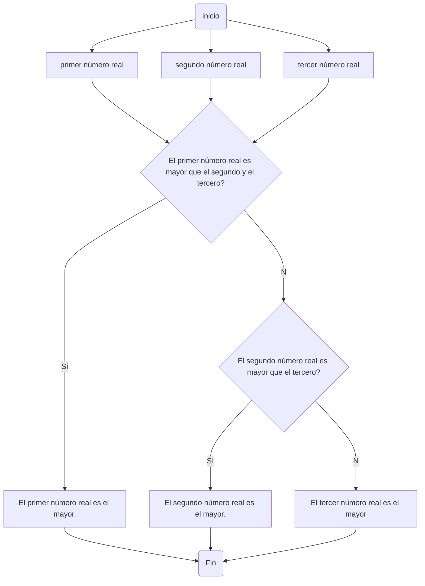
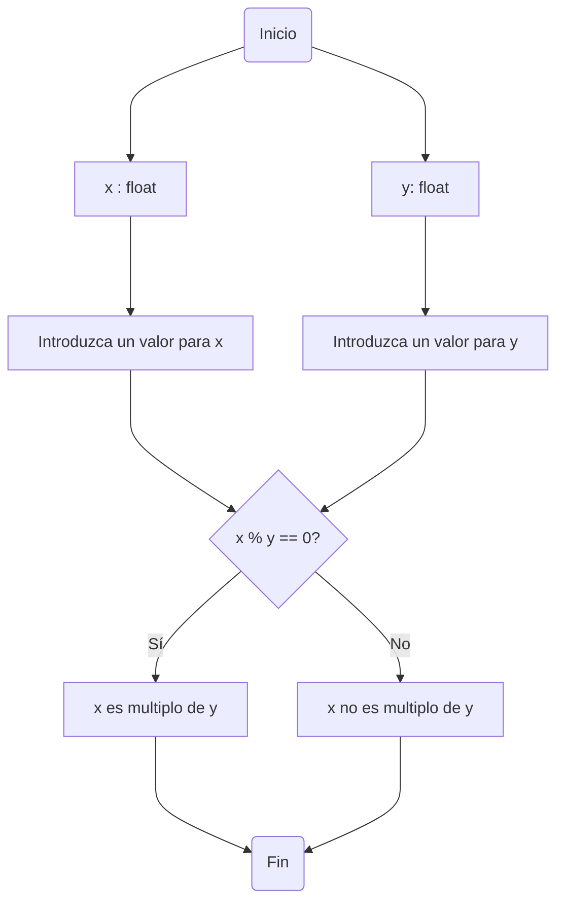

# Taller 1

### Nombre del grupo:
# Agrocode industry

Integrantes:
* Paula Jiménez Quiñones
* Mario Alejandro Martinez
* David Rodriguez Rueda

## Primer punto


## Segundo punto
Realice un programa que lea tres números reales y determine cuál es el mayor.

**Diagrama de flujo**

## Tercer punto


## Cuarto punto

### Problema planteado:
### Realice un programa que lea dos números reales y determine si el primero es múltiplo del segundo.

### La solución del problema es la siguiente:
1. Lo primero que se hizo fue declarar las variables como números flotantes.
2. Seguido a esto inicializamos las variables que van a ser número ingresados por las personas que estén utilizando el programa.
3. Después condicionamos de la siguiente forma
   * Si x % y == 0 entonces, x es multiplo de y.
   * Sino entonces x no es multiplo de y.

Y de esta manera fue solucionado el problema incialmente planteado.

##### El código del rpoblema es el siguiente:
```
#declaramos variables
x : float
y : float
#inicializamos variables
print("Comprobaremos si x es multiplo de y")
x = float(input("Introduzca un valor para x: "))
y = float(input("Introduzca un valor para y: "))
#condicionamos
if x % y == 0:
    print(x, "es multiplo de", y)
else:
    print(x, "no es multiplo", y)
```

##### El diagrama de flujo representando la solución del problema es el siguiente:


## Quinto punto


## Sexto punto


## Séptimo punto


## Octavo punto

### Problema planteado:
### Escriba un programa al que se le ingrese la frecuencia de una onda en hz y como salida arroje en que parte del espectro electromagnético se encuentra.

### Solución del problema:
1. Se declara variable que en este caso sería: hz. Esta variable puede ser un flotante.
2. La inicialización de la variable va a ser un número que introduzca el sujeto que esté utilizando el programa.
3. Después de esto condicionamos teniendo en cuenta que hay varias áreas del espectro electromagnético.
   * Iniciamos con la condición if, si el número ingresado por la persona está en el campo ingresado por esta persona saldría un mensaje sobre cual es el espectro electromagnético
   * Como hay muchas más condiciones en las cuales las ondas pueden estar en otras áreas del espectro electromagnético entonces se usa elif para cada una de ellas.
   * El uso de else lo utilizaremos para la última área del espectro electromagnético que vamos a tener en cuanta según la frecuencia.

Y de esta manera se solucionaría el problema planteado

##### El código de la solución del problema es el siguiente:
```
#Cual es el problema a abordar?
print("¿En que espectro electromagnético está la onda en hertz?")
#Declaramos variables
hz : float
#Inicializamos variable
hz = float(input("Ingrese los hertz que usted estime para una onda(se recomienda en notación cientifica): "))
#Condicionamos
if hz <= 30e4:
    print("Cuando la frecuencia de la honda es de", hz, "hertz, la onda tiene un espectro electromagnético de frecuencias extremadamente bajas")
elif 30e4 < hz <= 30e9:
    print("Cuando la frecuencia de la honda es de", hz, "hertz, la onda tiene un espectro electromagnético de tipo: Radio")
elif 30e9 < hz <= 30e11:
    print("Cuando la frecuencia de la honda es de", hz, "hertz, la onda tiene un espectro electromagnético de tipo: Microondas")
elif 30e11 < hz <= 30e14:
    print("Cuando la frecuencia de la honda es de", hz, "hertz, la onda tiene un espectro electromagnético de tipo: Infrarrojo")
elif 30e14 < hz <= 30e15:
    print("Cuando la frecuencia de la honda es de", hz, "hertz, la onda tiene un espectro electromagnético visible para el ojo humano")
elif 30e15 < hz <= 30e16:
    print("Cuando la frecuencia de la honda es de", hz, "hertz, la onda tiene un espectro electromagnético de tipo: Ultravioleta")
elif 30e16 < hz <= 30e20:
    print("Cuando la frecuencia de la honda es de", hz, "hertz, la onda tiene un espectro electromagnético de tipo: Rayos X")
elif 30e20 < hz <= 30e21:
    print("Cuando la frecuencia de la honda es de", hz, "hertz, la onda tiene un espectro electromagnético de tipo: Rayos Gamma")
else:
    print("Cuando la frecuencia de la honda es de", hz, "hertz, la onda tiene un espectro electromagnético de tipo: Rayos cósmicos")
```

## Noveno punto

### Problema planteado:
### Escriba un programa que reciba el nombre en minúsculas de un país de America y retorne la ciudad capital, si el país no pertenece al continente debe arrojar país no identificado.

### La solución del problema es la siguiente:
La solución del ejercicio es el siguiente:
1. Lo primero que se tuvo en cuenta a la hora de resolver este problema fue crear una pregunta para que la persona que utilizara este código pueda orientarse.
2. Declaramos la variable que en este caso será 'p' como un string.
3. La inicialización de la variable será pedirle a la persona que este utilizando el programa que ingrese un pais con unas condiciones determinadas.
4. Empezamos a hacer el uso del If, elif y else de la siguiente manera.
    * Se pone la primera condición, que será de acuerdo a si en el pais que se ingresó se utilizan solo caracteres de letras minusculas, si es así da paso a la otra condición que llamaremos c2. Si por algún motivo se puso algún pais en caracteres de letras mayúsculas entonces saldrá el mensaje: "p está en mayuscula, acuerdate que tienes que ingresas caracteres en minuscula"
    * Si  cumplimos la primera condición pasaremos a c2, acá se ve if, else y elif. Se puso una condición de cualquier país de América que se introduzca dará su capital, a través de condiciones a partir de if y elif; si se introduce un país que no es de América o alguna palabra que no tiene nada que ver saldrá entonces el siguiente mensaje: "p no es parte del continente americano".
    
Y con esto se terminaría la creación de la solución para el problema planteado

##### El código de la solución del problema es el siguiente:
```
#Ponemos pregunta orientadora del programa
print("¿Este país es del continente americano?")
#Declaramos variables
p : str
#Inicializamos variables
p = input("Ingrese un pais de América en minuscula: ")
#Condicionamos
if p.islower():
    if p == "estados unidos":
        print("la capital de", p, "es Washington D.C")
    elif p == "antigua y barbuda":
        print("la capital de", p, "es St.John's")
    elif p == "bahamas":
        print("la capital de", p, "es Nassau")
    elif p == "barbados":
        print("la capital de", p, "Bridgetown")
    elif p == "canada" or p == "canadá":
        print("la capital de", p, "es Ottawa")
    elif p == "cuba":
        print("la capital de", p, "es La Habana")
    elif p == "dominica":
        print("la capital de", p, "es Roseau")
    elif p == "republica dominicana" or p == "república dominicana":
        print("la capital de", p, "es Santos Domingo")
    elif p == "granada":
        print("la capital de", p, "es St.George")
    elif p == "haiti":
        print("la capital de", p, "es Puerto Principe")
    elif p == "jamaica":
        print("la capital de", p, "es Kingston")
    elif p == "mexico" or p == "méxico":
        print("la capital de", p, "es Ciudad de México")
    elif p == "san cristobal y nieves" or p == "san cristóbal y nieves":
        print("la capital de", p, "es Basseterre")
    elif p == "santa lucia" or p == "santa lucía":
        print("la capital de", p, "es Castries")
    elif p == "san vicente y las granadinas":
        print("la capital de", p, "es Kingstown")
    elif p == "guyana":
        print("la capital de", p, "es Georgetown")
    elif p == "trinidad y tobago":
        print("la capital de", p, "es Puerto España")
    elif p == "belice":
        print("la capital de", p, "es Belmopán")
    elif p == "costa rica":
        print("la capital de", p, "es San José")
    elif p == "el salvador":
        print("la capital de", p, "San Salvador")
    elif p == "guatemala":
        print("la capital de", p, "Ciudad de Guatemala")
    elif p == "honduras":
        print("la capital de", p, "es Tegucigalpa")
    elif p == "nicaragua":
        print("la capital de", p, "es Managua")
    elif p == "panama" or p == "panamá":
        print("la capital de", p, "es St.John's")
    elif p == "argentina":
        print("la capital de", p, "es Buenos Aires")
    elif p == "bolivia":
        print("la capital de", p, "es Sucre")
    elif p == "brasil":
        print("la capital de", p, "es Brasilia")
    elif p == "colombia":
        print("la capital de", p, "es Bogotá")
    elif p == "ecuador":
        print("la capital de", p, "es Quito")
    elif p == "paraguay":
        print("la capital de", p, "es Asunción")
    elif p == "peru" or p == "perú":
        print("la capital de", p, "es Lima")
    elif p == "surinam":
        print("la capital de", p, "es Parabarimo")
    elif p == "uruguay":
        print("la capital de", p, "es Montevideo")
    elif p == "venezuela":
        print("la capital de", p, "es Caracas")
    else:
        print("pais no identificado")
else:
    print(p, "está en mayuscula, acuerdate que tienes que ingresas caracteres en minuscula")
```

## Décimo punto


