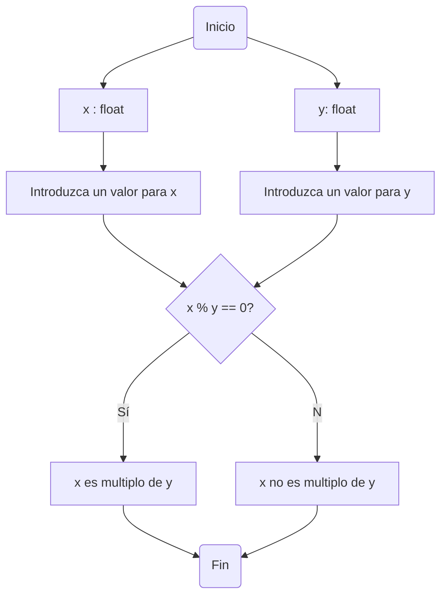

# Taller 1

### Nombre del grupo:
Agrocode industry

### Integrantes:
* Paula Jiménez Quiñones
* Mario Alejandro Martinez
* David Rodriguez Rueda

### Logo:


## Primer punto


## Segundo punto
**Problema planteado**

Realice un programa que lea tres números reales y determine cuál es el mayor.

**Explicación de la solución**
1. Declarar variables
   * Se declaran tres variables, donde cada una de las variables corresponde a uno de los tres números reales que lee el programa.
   * Se establecen los nombres de las variables utilizando _Camelcase_, estas se nombran numeroUno, numeroDos y numeroTres.
   * Se especifica que las variables son de tipo _float_, dado a que el programa requiere de números reales.
2. Inicializar variables
    * Se utiliza la función _input()_ para que el usuario pueda ingresar los tres números reales al programa.
3. Estructura if-elif-else
   * Con el operador lógico > y el operador relacional _and_ se establece la condición de que si el primer número ingresado es mayor que el segundo y mayor que el tercero, entonces ese número es el mayor. Por lo tanto, se imprime ese número.
   * Con _elif_ y el operador lógico > se determina que, en caso de que la anterior condición no se cumpla, cuando el segundo número ingresado es mayor que el tercero, ese número es el mayor. Por ende, se imprime este segundo número.
   * Con _else_ se establece que en caso de que las anteriores condiciones no se cumplan, el tercer número ingresado es el mayor. Por lo que se imprime este número.

**Código**
```
print("Este programa lee tres número reales y determina cuál es el mayor") #Se explica cual es el propósito del programa

#Se declaran las variables; estableciendo sus nombres utilizando Camelcase y especificando que son de tipo float (dado a que el programa funciona con números reales)
numeroUno:float
numeroDos:float
numeroTres:float

#Se utiliza la función input(), para que el usuario pueda ingresar los datos al programa
numeroUno=float(input("Ingrese el primer número real: "))
numeroDos=float(input("Ingrese el segundo número real: "))
numeroTres=float(input("Ingrese el tercer número real: "))

if numeroUno>numeroDos and numeroUno>numeroTres:
        print("El número "+str(numeroUno) + " es el mayor.")#El primer número es el mayor cuando es más grande que el segundo y que el tercero
elif numeroDos>numeroTres:
        print("El número "+str(numeroDos), " es el mayor.")#Si el primer número no es mayor que el segundo y el segundo número es mayor que el tercero, el segundo número tiene que ser el mayor.
else:
        print("El número "+str(numeroTres), " es el mayor.")#Si el primer número y el segundo no son mayores que el tercero, el tercero tiene que ser el mayor.
```

**Diagrama de flujo** 

## Tercer punto
**Problema planteado**

Realice un programa que lea un número entero y determine si es par o impar.

**Explicación de la solución**
1. Declarar variables
   * Se declara una variable, que corresponde al número entero que lee el programa.
   * Se establece el nombre de la variable utilizando _Camelcase_, esta se nombra numeroEntero.
   * Se especifica que la variable es de tipo _int_, dado a que el programa requiere de un número entero.
2. Inicializar variable
   * Se utiliza la función _input()_ para que el usuario pueda ingresar el número entero que desee al programa.
4. Estructura if-else
   * Con el operador aritmético % y el operador lógico == se establece la condición de que si el modulo entre el número entero ingresado y el número 2 es igual a 0, entonces el número ingresado al programa es par. Sí la condición se cumple, entonces se imprime la frase "El número insertado es par".
   * Con _else_ se establece que cuando la anterior condición no se cumple, el número ingresado al programa es impar. Por ende, se imprime la frase "El número insertado es impar".

**Código**
```
print("Este programa lee un número entero y determina si es par o impar.") #Se explica cual es el propósito del programa

#Se declara la variable; estableciendo su nombre utilizando Camelcase y especificando que esta es de tipo int (dado a que el programa funciona con números enteros)
numeroEntero:int

#Se utiliza la función input(), para que el usuario pueda ingresar el dato del número entero al programa
numeroEntero=int(input("Inserte un número entero "))

if numeroEntero%2==0:
    print("El número insertado es par")#Cuando el número ingresado se divide entre dos y no queda ningún residuo, significa que este es par
else:
    print("El número insertado es impar")#El número es impar cuando este se divide entre 2 y el residuo no es cero.
```
## Cuarto punto

### Problema planteado:
### Realice un programa que lea dos números reales y determine si el primero es múltiplo del segundo.

### La solución del problema es la siguiente:
1. Lo primero que se hizo fue declarar las variables como números flotantes.
2. Seguido a esto inicializamos las variables que van a ser número ingresados por las personas que estén utilizando el programa.
3. Después condicionamos de la siguiente forma
   * Si x % y == 0 entonces, x es multiplo de y.
   * Sino entonces x no es multiplo de y.

Y de esta manera fue solucionado el problema incialmente planteado.

##### El código del problema es el siguiente:
```
#declaramos variables
x : float
y : float
#inicializamos variables
print("Comprobaremos si x es multiplo de y")
x = float(input("Introduzca un valor para x: "))
y = float(input("Introduzca un valor para y: "))
#condicionamos
if x % y == 0:
    print(x, "es multiplo de", y)
else:
    print(x, "no es multiplo", y)
```

##### El diagrama de flujo representando la solución del problema es el siguiente:


## Quinto punto

### Problema planteado:
### Realice un programa que lea tres números reales y determine si la suma de los dos primeros es mayor, menor o igual que el tercer número.

### La solución del problema es la siguiente:
Se solicita al usuario que ingrese tres números decimales. Cada número se almacena en las variables num1, num2 y num3.
Se calcula la suma de num1 y num2, y el resultado se almacena en la variable suma.
Se utiliza una estructura condicional if-elif-elif para comparar la suma con el valor de num3. A continuación se describen las condiciones y las acciones correspondientes:
Si la suma es mayor que num3, se ejecuta la primera rama del condicional:
Imprime el mensaje "la suma es mayor que el tercer número".
Si la suma es menor que num3, se ejecuta la segunda rama del condicional:
Imprime el mensaje "la suma es menor que el tercer número".
Si la suma es igual a num3, se ejecuta la tercera rama del condicional:
Imprime el mensaje "la suma es igual al tercer número".
El programa termina después de ejecutar una de las tres ramas condicionales, dependiendo de cómo se compare la suma con num3. En otras palabras, determina si la suma es mayor, menor o igual al tercer número ingresado por el usuario y proporciona un mensaje de acuerdo a esa comparación.

##### El código del problema es el siguiente:
```
# Solicita al usuario que ingrese el primer número y lo almacena en la variable num1
num1 = float(input("Ingrese el primer número: "))

# Solicita al usuario que ingrese el segundo número y lo almacena en la variable num2
num2 = float(input("Ingrese el segundo número: "))

# Solicita al usuario que ingrese el tercer número y lo almacena en la variable num3
num3 = float(input("Ingrese el tercer número: "))

# Calcula la suma de num1 y num2 y almacena el resultado en la variable suma
suma = num1 + num2

# Compara la suma con num3 y muestra un mensaje de acuerdo a la comparación
if suma > num3:
   print("La suma es mayor que el tercer número")
elif suma < num3:
   print("La suma es menor que el tercer número")
elif suma == num3:
   print("La suma es igual al tercer número")
```

##### El diagrama de flujo representando la solución del problema es el siguiente:



## Sexto punto
### Problema planteado:
### Escriba un programa que solicite al usuario una letra y determine si es una vocal o una consonante.

### La solución del problema es la siguiente:
Se solicita al usuario que ingrese una letra.
Se definen dos listas de caracteres:
vocales: Una lista que contiene las letras 'a', 'e', 'i', 'o' y 'u', representando las vocales en español.
consonantes: Una lista que contiene varias letras, representando las consonantes en español.

##### El código del problema es el siguiente:
```
# Define las listas de vocales y consonantes
vocales = ['a', 'e', 'i', 'o', 'u']
consonantes = ['b', 'c', 'd', 'f', 'g', 'h', 'j', 'k', 'l', 'm', 'n', 'ñ', 'p', 'q', 'r', 's', 't', 'v', 'w', 'x', 'y', 'z']

letra = input("Ingrese una letra: ")

# Verifica si la letra ingresada por el usuario es una vocal
if letra in vocales:
    print("Es una vocal.")
# Verifica si la letra ingresada por el usuario es una consonante
elif letra in consonantes:
    print("Es una consonante.")
else:
    print("No es ni vocal ni consonante.")
```

## Séptimo Punto
**Problema planteado**

Escriba un programa que pida 5 números reales y calcule las siguientes operaciones:
* El promedio
* La mediana
* El promedio multiplicativo (multiplica todos y luego calcula la raíz de la cantidad de operandos)
* Ordenar los números de forma ascendente
* Ordenar los números de forma descendente
* La potencia del mayor número elevado al menor número
* La raíz cúbica del menor número

**Explicación de la solución**
1. Declarar variables
    * Se declaran cinco variables, donde cada una de las variables corresponde a uno de los cinco números reales que lee el programa.
    * Se establecen los nombres de las variables, por practicidad estas se nombran a, b, c, d y e. 
    * Se especifica que las variables son de tipo float, dado a que el programa requiere de números reales.
2. Inicializar variables
    * Se utiliza la función input() para que el usuario pueda ingresar los cinco números reales al programa.
3. El promedio
    * Utilizando los operadores aritméticos + y / se establece que para calcular el promedio se debe sumar los cinco números ingresados y luego se deben dividir entre 5 (que es la cantidad de números ingresados). La suma se puso entre paréntesis, con el fin de que se le dé prioridad a la suma y luego se lleve a cabo la división.
    * El programa imprime el resultado del promedio
4. El promedio multiplicativo
    * Utilizando los operadores aritméticos * y ** se establece que para calcular el promedio multiplicativo se deben multiplicar los cinco números ingresados y luego se debe elevar el resultado a la 1/5. Se eleva a la 1/5, dado a que la forma radical se convierte en un exponente en forma de fracción y debido a que se debe calcular la raíz de la cantidad de operandos y esta cantidad corresponde a 5. La multiplicación y la fracción se pusieron entre paréntesis, para que primero se calculara la multiplicación y la división y posteriormente se hiciera el cálculo de la potencia.
    * El programa imprime el resultado del promedio multiplicativo.
5. Orden ascendente y mediana
    * Utilizando la estructura _if-elif-else_ y el operador lógico > se establece la forma en la que se deberían organizar los cinco números ingresados de tal manera que queden organizados desde el más pequeño hasta el más grande.
    * Por medio de la estructura condicional, se logra que el programa lea los 5 números ingresados, determine a cuál de los 120 posibles casos de orden de las variables pertenece e imprima el valor de estas variables en orden ascendente.
    * Para desarrollar el programa que ordena a los números de forma ascendente, se utiliza _if-elif-else_ y > para determinar el orden ascendente de las variables cuando la primera variable ingresada (_a_) es la menor y por lo tanto la primera. En total, cuando la variable _a_ es la menor, las variables se pueden organizar en 24 formas distintas. 
    * Luego, se utilizó el mismo código, pero reemplazando el nombre de la primera variable por el nombre de la segunda para obtener el orden de las variables cuando la segunda variable ingresada (_b_) es la menor. Esto se hizo sucesivamente hasta tener el código con los 120 casos de organización de las variables.
    * Dado a que ya se tienen las variables organizadas de menor a mayor, se le pide al programa que en cada uno de los casos se imprima la variable que se encuentra en la mitad, obteniendo de esta forma la mediana. Esto se llevó a cabo manualmente.
6. Orden descendente
    * Ya teniendo el código para ordenar los números de forma ascendente, se copió este código y se cambiaron todos < por el operador lógico >.
7. La potencia del mayor número elevado al menor número y la raíz cúbica del menor número
    * Utilizando _if_ , _and_ y el operador lógico < se establece que si la variable _a_ es menor que las otras cuatro variables entonces el programa debe imprimir la raíz cúbica de _a_. Este cálculo se plantea como _a_ elevado a ½, dado a que la raíz es transformada a una potencia. 
    * Posteriormente, se utiliza la estructura _if-elif-else_ y el operador lógico > para determinar cuál de las otras variables es la mayor. Cuando el programa determina el mayor número, imprime este mayor número elevado al menor número. Este cálculo se establece con el operador aritmético **.
    * El mismo código se copia y se pega y se cambia el nombre de las variables para que el programa haga el mismo proceso cuando las variables _b_, _c_, _d_ y _e_ son la menores.

**Código**
```
print("Este programa permite hallar el promedio, la mediana, el promedio multiplicativo, el orden ascendente y descendente de los números, la potencia del mayor número elevado al menor número y la raíz cúbica del menor número cuando se insertan 5 números reales")

a:float
b:float
c:float
d:float
e:float

a=float(input("Ingrese el primer número real "))
b=float(input("Ingrese el segundo número real "))
c=float(input("Ingrese el tercer número real "))
d=float(input("Ingrese el cuarto número real "))
e=float(input("Ingrese el quinto número real "))

promedio=(a+b+c+d+e)/5
print("El promedio de los cinco números reales es", str(promedio))

promedioMultiplicativo=(a*b*c*d*e)**(1/5)
print("El promedio multiplicativo es", str(promedioMultiplicativo))

if a<b and a<c and a<d and a<e:
    if b<c:
        if c<d:
            if d<e:
                print("Los números ordenados de forma ascendente son: ", str (a ), str(b ), str(c ), str(d ), str(e ))
                print("La mediana es: ", str(c))
            elif e<b:
                print("Los números ordenados de forma ascendente son: ", str (a ), str(e ), str(b ), str(c ), str(d ))
                print("La mediana es: ", str(b))
            elif c<e:
                print("Los números ordenados de forma ascendente son: ", str (a ), str(b ), str(c ), str(e ), str(d ))
                print("La mediana es: ", str(c))
            else:
                print("Los números ordenados de forma ascendente son: ", str (a ), str(b ), str(e ), str(c ), str(d ))
                print("La mediana es: ", str(e))
        else:
            if b<d:
                if d<e:
                    if e<c:
                        print("Los números ordenados de forma ascendente son: ", str (a ), str(b ), str(d ), str(e ), str(c ))
                        print("La mediana es: ", str(d))
                    else:
                        print("Los números ordenados de forma ascendente son: ", str (a ), str(b ), str(d ), str(c ), str(e ))
                        print("La mediana es: ", str(d))
                else:
                    if b<e:
                        print("Los números ordenados de forma ascendente son: ", str (a ), str(b ), str(e ), str(d ), str(c ))
                        print("La mediana es: ", str(e))
                    else:
                        print("Los números ordenados de forma ascendente son: ", str (a ), str(e ), str(b ), str(d ), str(c ))
                        print("La mediana es: ", str(b))
            else:
                if e<c:
                    if e<d:
                        print("Los números ordenados de forma ascendente son: ", str (a ), str(e ), str(d ), str(b ), str(c ))
                        print("La mediana es: ", str(d))
                    elif b<e:
                        print("Los números ordenados de forma ascendente son: ", str (a ), str(d ), str(b ), str(e ), str(c ))
                        print("La mediana es: ", str(b))
                    else:
                        print("Los números ordenados de forma ascendente son: ", str (a ), str(d ), str(e ), str(b ), str(c ))
                        print("La mediana es: ", str(e))
                else:
                    print("Los números ordenados de forma ascendente son: ", str (a ), str(d ), str(b ), str(c ), str(e ))
                    print("La mediana es: ", str(b))

    elif c<d  and c<e:
        if b<d:
            if d<e:
                print("Los números ordenados de forma ascendente son: ", str (a ), str(c ), str(b ), str(d ), str(e ))
                print("La mediana es: ", str(b))
            elif b<e:
                print("Los números ordenados de forma ascendente son: ", str (a ), str(c ), str(b ), str(e ), str(d ))
                print("La mediana es: ", str(b))
            else:
                print("Los números ordenados de forma ascendente son: ", str (a ), str(c ), str(e ), str(b ), str(d ))
                print("La mediana es: ", str(e))
        elif d<e:
            if e<b:
                print("Los números ordenados de forma ascendente son: ", str (a ), str(c ), str(d ), str(e ), str(b ))
                print("La mediana es: ", str(d))
            else:
                print("Los números ordenados de forma ascendente son: ", str (a ), str(c ), str(d ), str(b ), str(e ))
                print("La mediana es: ", str(d))
        else:
            print("Los números ordenados de forma ascendente son: ", str (a ), str(c ), str(e ), str(d ), str(b ))
            print("La mediana es: ", str(e))
    else:
        if d<c:
            if d<e:
                if b<e:
                    print("Los números ordenados de forma ascendente son: ", str (a ), str(d ), str(c ), str(b ), str(e ))
                    print("La mediana es: ", str(c))
                elif c<e:
                    print("Los números ordenados de forma ascendente son: ", str (a ), str(d ), str(c ), str(e ), str(b ))
                    print("La mediana es: ", str(c))
                else:
                    print("Los números ordenados de forma ascendente son: ", str (a ), str(d ), str(e ), str(c ), str(b ))
                    print("La mediana es: ", str(e))
            else:
                print("Los números ordenados de forma ascendente son: ", str (a ), str(e ), str(d ), str(c ), str(b ))
                print("La mediana es: ", str(d))
        else:
            if d<b:
                print("Los números ordenados de forma ascendente son: ", str (a ), str(e ), str(c ), str(d ), str(b ))
                print("La mediana es: ", str(c))
            else:
                print("Los números ordenados de forma ascendente son: ", str (a ), str(e ), str(c ), str(b ), str(d ))
                print("La mediana es: ", str(c))
elif b<a and b<c and b<d and b<e:
    if a<c:
        if c<d:
            if d<e:
                print("Los números ordenados de forma ascendente son: ", str (b ), str(a ), str(c ), str(d ), str(e ))
                print("La mediana es: ", str(c))
            elif e<a:
                print("Los números ordenados de forma ascendente son: ", str (b ), str(e ), str(a ), str(c ), str(d ))
                print("La mediana es: ", str(a))
            elif c<e:
                print("Los números ordenados de forma ascendente son: ", str (b ), str(a ), str(c ), str(e ), str(d ))
                print("La mediana es: ", str(c))
            else:
                print("Los números ordenados de forma ascendente son: ", str (b ), str(a ), str(e ), str(c ), str(d ))
                print("La mediana es: ", str(e))
        else:
            if a<d:
                if d<e:
                    if e<c:
                        print("Los números ordenados de forma ascendente son: ", str (b ), str(a ), str(d ), str(e ), str(c ))
                        print("La mediana es: ", str(d))
                    else:
                        print("Los números ordenados de forma ascendente son: ", str (b ), str(a ), str(d ), str(c ), str(e ))
                        print("La mediana es: ", str(d))
                else:
                    if a<e:
                        print("Los números ordenados de forma ascendente son: ", str (b ), str(a ), str(e ), str(d ), str(c ))
                        print("La mediana es: ", str(e))
                    else:
                        print("Los números ordenados de forma ascendente son: ", str (b ), str(e ), str(a ), str(d ), str(c ))
                        print("La mediana es: ", str(a))
            else:
                if e<c:
                    if e<d:
                        print("Los números ordenados de forma ascendente son: ", str (b ), str(e ), str(d ), str(a ), str(c ))
                        print("La mediana es: ", str(d))
                    elif a<e:
                        print("Los números ordenados de forma ascendente son: ", str (b ), str(d ), str(a ), str(e ), str(c ))
                        print("La mediana es: ", str(a))
                    else:
                        print("Los números ordenados de forma ascendente son: ", str (b ), str(d ), str(e ), str(a ), str(c ))
                        print("La mediana es: ", str(e))
                else:
                    print("Los números ordenados de forma ascendente son: ", str (b ), str(d ), str(a ), str(c ), str(e ))
                    print("La mediana es: ", str(a))

    elif c<d  and c<e:
        if a<d:
            if d<e:
                print("Los números ordenados de forma ascendente son: ", str (b ), str(c ), str(a ), str(d ), str(e ))
                print("La mediana es: ", str(a))
            elif a<e:
                print("Los números ordenados de forma ascendente son: ", str (b ), str(c ), str(a ), str(e ), str(d ))
                print("La mediana es: ", str(a))
            else:
                print("Los números ordenados de forma ascendente son: ", str (b ), str(c ), str(e ), str(a ), str(d ))
                print("La mediana es: ", str(e))
        elif d<e:
            if e<a:
                print("Los números ordenados de forma ascendente son: ", str (b ), str(c ), str(d ), str(e ), str(a ))
                print("La mediana es: ", str(d))
            else:
                print("Los números ordenados de forma ascendente son: ", str (b ), str(c ), str(d ), str(a ), str(e ))
                print("La mediana es: ", str(d))
        else:
            print("Los números ordenados de forma ascendente son: ", str (b ), str(c ), str(e ), str(d ), str(a ))
            print("La mediana es: ", str(e))
    else:
        if d<c:
            if d<e:
                if a<e:
                    print("Los números ordenados de forma ascendente son: ", str (b ), str(d ), str(c ), str(a ), str(e ))
                    print("La mediana es: ", str(c))
                elif c<e:
                    print("Los números ordenados de forma ascendente son: ", str (b ), str(d ), str(c ), str(e ), str(a ))
                    print("La mediana es: ", str(c))
                else:
                    print("Los números ordenados de forma ascendente son: ", str (b ), str(d ), str(e ), str(c ), str(a ))
                    print("La mediana es: ", str(e))
            else:
                print("Los números ordenados de forma ascendente son: ", str (b ), str(e ), str(d ), str(c ), str(a ))
                print("La mediana es: ", str(d))
        else:
            if d<a:
                print("Los números ordenados de forma ascendente son: ", str (b ), str(e ), str(c ), str(d ), str(a ))
                print("La mediana es: ", str(c))
            else:
                print("Los números ordenados de forma ascendente son: ", str (b ), str(e ), str(c ), str(a ), str(d ))
                print("La mediana es: ", str(c))
elif c<a and c<b and c<d and c<e:
    if a<b:
        if b<d:
            if d<e:
                print("Los números ordenados de forma ascendente son: ", str (c ), str(a ), str(b ), str(d ), str(e ))
                print("La mediana es: ", str(b))
            elif e<a:
                print("Los números ordenados de forma ascendente son: ", str (c ), str(e ), str(a ), str(b ), str(d ))
                print("La mediana es: ", str(a))
            elif b<e:
                print("Los números ordenados de forma ascendente son: ", str (c ), str(a ), str(b ), str(e ), str(d ))
                print("La mediana es: ", str(b))
            else:
                print("Los números ordenados de forma ascendente son: ", str (c ), str(a ), str(e ), str(b ), str(d ))
                print("La mediana es: ", str(e))
        else:
            if a<d:
                if d<e:
                    if e<b:
                        print("Los números ordenados de forma ascendente son: ", str (c ), str(a ), str(d ), str(e ), str(b ))
                        print("La mediana es: ", str(d))
                    else:
                        print("Los números ordenados de forma ascendente son: ", str (c ), str(a ), str(d ), str(b ), str(e ))
                        print("La mediana es: ", str(d))
                else:
                    if a<e:
                        print("Los números ordenados de forma ascendente son: ", str (c ), str(a ), str(e ), str(d ), str(b ))
                        print("La mediana es: ", str(e))
                    else:
                        print("Los números ordenados de forma ascendente son: ", str (c ), str(e ), str(a ), str(d ), str(b ))
                        print("La mediana es: ", str(a))
            else:
                if e<b:
                    if e<d:
                        print("Los números ordenados de forma ascendente son: ", str (c ), str(e ), str(d ), str(a ), str(b ))
                        print("La mediana es: ", str(d))
                    elif a<e:
                        print("Los números ordenados de forma ascendente son: ", str (c ), str(d ), str(a ), str(e ), str(b ))
                        print("La mediana es: ", str(a))
                    else:
                        print("Los números ordenados de forma ascendente son: ", str (c ), str(d ), str(e ), str(a ), str(b ))
                        print("La mediana es: ", str(e))
                else:
                    print("Los números ordenados de forma ascendente son: ", str (c ), str(d ), str(a ), str(b ), str(e ))
                    print("La mediana es: ", str(a))

    elif b<d  and b<e:
        if a<d:
            if d<e:
                print("Los números ordenados de forma ascendente son: ", str (c ), str(b ), str(a ), str(d ), str(e ))
                print("La mediana es: ", str(a))
            elif a<e:
                print("Los números ordenados de forma ascendente son: ", str (c ), str(b ), str(a ), str(e ), str(d ))
                print("La mediana es: ", str(a))
            else:
                print("Los números ordenados de forma ascendente son: ", str (c ), str(b ), str(e ), str(a ), str(d ))
                print("La mediana es: ", str(e))
        elif d<e:
            if e<a:
                print("Los números ordenados de forma ascendente son: ", str (c ), str(b ), str(d ), str(e ), str(a ))
                print("La mediana es: ", str(d))
            else:
                print("Los números ordenados de forma ascendente son: ", str (c ), str(b ), str(d ), str(a ), str(e ))
                print("La mediana es: ", str(d))
        else:
            print("Los números ordenados de forma ascendente son: ", str (c ), str(b ), str(e ), str(d ), str(a ))
            print("La mediana es: ", str(e))
    else:
        if d<b:
            if d<e:
                if a<e:
                    print("Los números ordenados de forma ascendente son: ", str (c ), str(d ), str(b ), str(a ), str(e ))
                    print("La mediana es: ", str(b))
                elif b<e:
                    print("Los números ordenados de forma ascendente son: ", str (c ), str(d ), str(b ), str(e ), str(a ))
                    print("La mediana es: ", str(b))
                else:
                    print("Los números ordenados de forma ascendente son: ", str (c ), str(d ), str(e ), str(b ), str(a ))
                    print("La mediana es: ", str(e))
            else:
                print("Los números ordenados de forma ascendente son: ", str (c ), str(e ), str(d ), str(b ), str(a ))
                print("La mediana es: ", str(d))
        else:
            if d<a:
                print("Los números ordenados de forma ascendente son: ", str (c ), str(e ), str(b ), str(d ), str(a ))
                print("La mediana es: ", str(b))
            else:
                print("Los números ordenados de forma ascendente son: ", str (c ), str(e ), str(b ), str(a ), str(d ))
                print("La mediana es: ", str(b))
elif d<a and d<b and d<c and d<e:
    if a<b:
        if b<c:
            if c<e:
                print("Los números ordenados de forma ascencente son: ", str (d ), str(a ), str(b ), str(c ), str(e ))
                print("La mediana es: ", str(b))
            elif e<a:
                print("Los números ordenados de forma ascencente son: ", str (d ), str(e ), str(a ), str(b ), str(c ))
                print("La mediana es: ", str(a))
            elif b<e:
                print("Los números ordenados de forma ascencente son: ", str (d ), str(a ), str(b ), str(e ), str(c ))
                print("La mediana es: ", str(b))
            else:
                print("Los números ordenados de forma ascencente son: ", str (d ), str(a ), str(e ), str(b ), str(c ))
                print("La mediana es: ", str(e))
        else:
            if a<c:
                if c<e:
                    if e<b:
                        print("Los números ordenados de forma ascencente son: ", str (d ), str(a ), str(c ), str(e ), str(b ))
                        print("La mediana es: ", str(c))
                    else:
                        print("Los números ordenados de forma ascencente son: ", str (d ), str(a ), str(c ), str(b ), str(e ))
                        print("La mediana es: ", str(c))
                else:
                    if a<e:
                        print("Los números ordenados de forma ascencente son: ", str (d ), str(a ), str(e ), str(c ), str(b ))
                        print("La mediana es: ", str(e))
                    else:
                        print("Los números ordenados de forma ascencente son: ", str (d ), str(e ), str(a ), str(c ), str(b ))
                        print("La mediana es: ", str(a))
            else:
                if e<b:
                    if e<c:
                        print("Los números ordenados de forma ascencente son: ", str (d ), str(e ), str(c ), str(a ), str(b ))
                        print("La mediana es: ", str(c))
                    elif a<e:
                        print("Los números ordenados de forma ascencente son: ", str (d ), str(c ), str(a ), str(e ), str(b ))
                        print("La mediana es: ", str(a))
                    else:
                        print("Los números ordenados de forma ascencente son: ", str (d ), str(c ), str(e ), str(a ), str(b ))
                        print("La mediana es: ", str(e))
                else:
                    print("Los números ordenados de forma ascencente son: ", str (d ), str(c ), str(a ), str(b ), str(e ))
                    print("La mediana es: ", str(a))

    elif b<c  and b<e:
        if a<c:
            if c<e:
                print("Los números ordenados de forma ascencente son: ", str (d ), str(b ), str(a ), str(c ), str(e ))
                print("La mediana es: ", str(a))
            elif a<e:
                print("Los números ordenados de forma ascencente son: ", str (d ), str(b ), str(a ), str(e ), str(c ))
                print("La mediana es: ", str(a))
            else:
                print("Los números ordenados de forma ascencente son: ", str (d ), str(b ), str(e ), str(a ), str(c ))
                print("La mediana es: ", str(e))
        elif c<e:
            if e<a:
                print("Los números ordenados de forma ascencente son: ", str (d ), str(b ), str(c ), str(e ), str(a ))
                print("La mediana es: ", str(c))
            else:
                print("Los números ordenados de forma ascencente son: ", str (d ), str(b ), str(c ), str(a ), str(e ))
                print("La mediana es: ", str(c))
        else:
            print("Los números ordenados de forma ascencente son: ", str (d ), str(b ), str(e ), str(c ), str(a ))
            print("La mediana es: ", str(e))
    else:
        if c<b:
            if c<e:
                if a<e:
                    print("Los números ordenados de forma ascencente son: ", str (d ), str(c ), str(b ), str(a ), str(e ))
                    print("La mediana es: ", str(b))
                elif b<e:
                    print("Los números ordenados de forma ascencente son: ", str (d ), str(c ), str(b ), str(e ), str(a ))
                    print("La mediana es: ", str(b))
                else:
                    print("Los números ordenados de forma ascencente son: ", str (d ), str(c ), str(e ), str(b ), str(a ))
                    print("La mediana es: ", str(e))
            else:
                print("Los números ordenados de forma ascencente son: ", str (d ), str(e ), str(c ), str(b ), str(a ))
                print("La mediana es: ", str(c))
        else:
            if c<a:
                print("Los números ordenados de forma ascencente son: ", str (d ), str(e ), str(b ), str(c ), str(a ))
                print("La mediana es: ", str(b))
            else:
                print("Los números ordenados de forma ascencente son: ", str (d ), str(e ), str(b ), str(a ), str(c ))
                print("La mediana es: ", str(b))
else:
    if a<b:
        if b<c:
            if c<d:
                print("Los números ordenados de forma ascendente son: ", str (e ), str(a ), str(b ), str(c ), str(d ))
                print("La mediana es: ", str(b))
            elif d<a:
                print("Los números ordenados de forma ascendente son: ", str (e ), str(d ), str(a ), str(b ), str(c ))
                print("La mediana es: ", str(a))
            elif b<d:
                print("Los números ordenados de forma ascendente son: ", str (e ), str(a ), str(b ), str(d ), str(c ))
                print("La mediana es: ", str(b))
            else:
                print("Los números ordenados de forma ascendente son: ", str (e ), str(a ), str(d ), str(b ), str(c ))
                print("La mediana es: ", str(d))
        else:
            if a<c:
                if c<d:
                    if d<b:
                        print("Los números ordenados de forma ascendente son: ", str (e ), str(a ), str(c ), str(d ), str(b ))
                        print("La mediana es: ", str(c))
                    else:
                        print("Los números ordenados de forma ascendente son: ", str (e ), str(a ), str(c ), str(b ), str(d ))
                        print("La mediana es: ", str(c))
                else:
                    if a<d:
                        print("Los números ordenados de forma ascendente son: ", str (e ), str(a ), str(d ), str(c ), str(b ))
                        print("La mediana es: ", str(d))
                    else:
                        print("Los números ordenados de forma ascendente son: ", str (e ), str(d ), str(a ), str(c ), str(b ))
                        print("La mediana es: ", str(a))
            else:
                if d<b:
                    if d<c:
                        print("Los números ordenados de forma ascendente son: ", str (e ), str(d ), str(c ), str(a ), str(b ))
                        print("La mediana es: ", str(c))
                    elif a<d:
                        print("Los números ordenados de forma ascendente son: ", str (e ), str(c ), str(a ), str(d ), str(b ))
                        print("La mediana es: ", str(a))
                    else:
                        print("Los números ordenados de forma ascendente son: ", str (e ), str(c ), str(d ), str(a ), str(b ))
                        print("La mediana es: ", str(d))
                else:
                    print("Los números ordenados de forma ascendente son: ", str (e ), str(c ), str(a ), str(b ), str(d ))
                    print("La mediana es: ", str(a))

    elif b<c  and b<d:
        if a<c:
            if c<d:
                print("Los números ordenados de forma ascendente son: ", str (e ), str(b ), str(a ), str(c ), str(d ))
                print("La mediana es: ", str(a))
            elif a<d:
                print("Los números ordenados de forma ascendente son: ", str (e ), str(b ), str(a ), str(d ), str(c ))
                print("La mediana es: ", str(a))
            else:
                print("Los números ordenados de forma ascendente son: ", str (e ), str(b ), str(d ), str(a ), str(c ))
                print("La mediana es: ", str(d))
        elif c<d:
            if d<a:
                print("Los números ordenados de forma ascendente son: ", str (e ), str(b ), str(c ), str(d ), str(a ))
                print("La mediana es: ", str(c))
            else:
                print("Los números ordenados de forma ascendente son: ", str (e ), str(b ), str(c ), str(a ), str(d ))
                print("La mediana es: ", str(c))
        else:
            print("Los números ordenados de forma ascendente son: ", str (e ), str(b ), str(d ), str(c ), str(a ))
            print("La mediana es: ", str(d))
    else:
        if c<b:
            if c<d:
                if a<d:
                    print("Los números ordenados de forma ascendente son: ", str (e ), str(c ), str(b ), str(a ), str(d ))
                    print("La mediana es: ", str(b))
                elif b<d:
                    print("Los números ordenados de forma ascendente son: ", str (e ), str(c ), str(b ), str(d ), str(a ))
                    print("La mediana es: ", str(b))
                else:
                    print("Los números ordenados de forma ascendente son: ", str (e ), str(c ), str(d ), str(b ), str(a ))
                    print("La mediana es: ", str(d))
            else:
                print("Los números ordenados de forma ascendente son: ", str (e ), str(d ), str(c ), str(b ), str(a ))
                print("La mediana es: ", str(c))
        else:
            if c<a:
                print("Los números ordenados de forma ascendente son: ", str (e ), str(d ), str(b ), str(c ), str(a ))
                print("La mediana es: ", str(b))
            else:
                print("Los números ordenados de forma ascendente son: ", str (e ), str(d ), str(b ), str(a ), str(c ))
                print("La mediana es: ", str(b))

if a>b and a>c and a>d and a>e:
    if b>c:
        if c>d:
            if d>e:
                print("Los números ordenados de forma descendente son: ", str(a), str(b), str(c), str(d), str(e))
            elif e>b:
                print("Los números ordenados de forma descendente son: ", str(a), str(e), str(b), str(c), str(d))
            elif c>e:
                print("Los números ordenados de forma descendente son: ", str(a), str(b), str(c), str(e), str(d))
            else:
                print("Los números ordenados de forma descendente son: ", str(a), str(b), str(e), str(c), str(d))
        else:
            if b>d:
                if d>e:
                    if e>c:
                        print("Los números ordenados de forma descendente son: ", str(a), str(b), str(d), str(e), str(c))
                    else:
                        print("Los números ordenados de forma descendente son: ", str(a), str(b), str(d), str(c), str(e))
                else:
                    if b>e:
                        print("Los números ordenados de forma descendente son: ", str(a), str(b), str(e), str(d), str(c))
                    else:
                        print("Los números ordenados de forma descendente son: ", str(a), str(e), str(b), str(d), str(c))
            else:
                if e>c:
                    if e>d:
                        print("Los números ordenados de forma descendente son: ", str(a), str(e), str(d), str(b), str(c))
                    elif b>e:
                        print("Los números ordenados de forma descendente son: ", str(a), str(d), str(b), str(e), str(c))
                    else:
                        print("Los números ordenados de forma descendente son: ", str(a), str(d), str(e), str(b), str(c))
                else:
                    print("Los números ordenados de forma descendente son: ", str(a), str(d), str(b), str(c), str(e))

    elif c>d  and c>e:
        if b>d:
            if d>e:
                print("Los números ordenados de forma descendente son: ", str(a), str(c), str(b), str(d), str(e))
            elif b>e:
                print("Los números ordenados de forma descendente son: ", str(a), str(c), str(b), str(e), str(d))
            else:
                print("Los números ordenados de forma descendente son: ", str(a), str(c), str(e), str(b), str(d))
        elif d>e:
            if e>b:
                print("Los números ordenados de forma descendente son: ", str(a), str(c), str(d), str(e), str(b))
            else:
                print("Los números ordenados de forma descendente son: ", str(a), str(c), str(d), str(b), str(e))
        else:
            print("Los números ordenados de forma descendente son: ", str(a), str(c), str(e), str(d), str(b))
    else:
        if d>c:
            if d>e:
                if b>e:
                    print("Los números ordenados de forma descendente son: ", str(a), str(d), str(c), str(b), str(e))
                elif c>e:
                    print("Los números ordenados de forma descendente son: ", str(a), str(d), str(c), str(e), str(b))
                else:
                    print("Los números ordenados de forma descendente son: ", str(a), str(d), str(e), str(c), str(b))
            else:
                print("Los números ordenados de forma descendente son: ", str(a), str(e), str(d), str(c), str(b))
        else:
            if d>b:
                print("Los números ordenados de forma descendente son: ", str(a), str(e), str(c), str(d), str(b))
            else:
                print("Los números ordenados de forma descendente son: ", str(a), str(e), str(c), str(b), str(d))
elif b>a and b>c and b>d and b>e:
    if a>c:
        if c>d:
            if d>e:
                print("Los números ordenados de forma descendente son: ", str(b), str(a), str(c), str(d), str(e))
            elif e>a:
                print("Los números ordenados de forma descendente son: ", str(b), str(e), str(a), str(c), str(d))
            elif c>e:
                print("Los números ordenados de forma descendente son: ", str(b), str(a), str(c), str(e), str(d))
            else:
                print("Los números ordenados de forma descendente son: ", str(b), str(a), str(e), str(c), str(d))
        else:
            if a>d:
                if d>e:
                    if e>c:
                        print("Los números ordenados de forma descendente son: ", str(b), str(a), str(d), str(e), str(c))
                    else:
                        print("Los números ordenados de forma descendente son: ", str(b), str(a), str(d), str(c), str(e))
                else:
                    if a>e:
                        print("Los números ordenados de forma descendente son: ", str(b), str(a), str(e), str(d), str(c))
                    else:
                        print("Los números ordenados de forma descendente son: ", str(b), str(e), str(a), str(d), str(c))
            else:
                if e>c:
                    if e>d:
                        print("Los números ordenados de forma descendente son: ", str(b), str(e), str(d), str(a), str(c))
                    elif a>e:
                        print("Los números ordenados de forma descendente son: ", str(b), str(d), str(a), str(e), str(c))
                    else:
                        print("Los números ordenados de forma descendente son: ", str(b), str(d), str(e), str(a), str(c))
                else:
                    print("Los números ordenados de forma descendente son: ", str(b), str(d), str(a), str(c), str(e))

    elif c>d  and c>e:
        if a>d:
            if d>e:
                print("Los números ordenados de forma descendente son: ", str(b), str(c), str(a), str(d), str(e))
            elif a>e:
                print("Los números ordenados de forma descendente son: ", str(b), str(c), str(a), str(e), str(d))
            else:
                print("Los números ordenados de forma descendente son: ", str(b), str(c), str(e), str(a), str(d))
        elif d>e:
            if e>a:
                print("Los números ordenados de forma descendente son: ", str(b), str(c), str(d), str(e), str(a))
            else:
                print("Los números ordenados de forma descendente son: ", str(b), str(c), str(d), str(a), str(e))
        else:
            print("Los números ordenados de forma descendente son: ", str(b), str(c), str(e), str(d), str(a))
    else:
        if d>c:
            if d>e:
                if a>e:
                    print("Los números ordenados de forma descendente son: ", str(b), str(d), str(c), str(a), str(e))
                elif c>e:
                    print("Los números ordenados de forma descendente son: ", str(b), str(d), str(c), str(e), str(a))
                else:
                    print("Los números ordenados de forma descendente son: ", str(b), str(d), str(e), str(c), str(a))
            else:
                print("Los números ordenados de forma descendente son: ", str(b), str(e), str(d), str(c), str(a))
        else:
            if d>a:
                print("Los números ordenados de forma descendente son: ", str(b), str(e), str(c), str(d), str(a))
            else:
                print("Los números ordenados de forma descendente son: ", str(b), str(e), str(c), str(a), str(d))
elif c>a and c>b and c>d and c>e:
    if a>b:
        if b>d:
            if d>e:
                print("Los números ordenados de forma descendente son: ", str(c), str(a), str(b), str(d), str(e))
            elif e>a:
                print("Los números ordenados de forma descendente son: ", str(c), str(e), str(a), str(b), str(d))
            elif b>e:
                print("Los números ordenados de forma descendente son: ", str(c), str(a), str(b), str(e), str(d))
            else:
                print("Los números ordenados de forma descendente son: ", str(c), str(a), str(e), str(b), str(d))
        else:
            if a>d:
                if d>e:
                    if e>b:
                        print("Los números ordenados de forma descendente son: ", str(c), str(a), str(d), str(e), str(b))
                    else:
                        print("Los números ordenados de forma descendente son: ", str(c), str(a), str(d), str(b), str(e))
                else:
                    if a>e:
                        print("Los números ordenados de forma descendente son: ", str(c), str(a), str(e), str(d), str(b))
                    else:
                        print("Los números ordenados de forma descendente son: ", str(c), str(e), str(a), str(d), str(b))
            else:
                if e>b:
                    if e>d:
                        print("Los números ordenados de forma descendente son: ", str(c), str(e), str(d), str(a), str(b))
                    elif a>e:
                        print("Los números ordenados de forma descendente son: ", str(c), str(d), str(a), str(e), str(b))
                    else:
                        print("Los números ordenados de forma descendente son: ", str(c), str(d), str(e), str(a), str(b))
                else:
                    print("Los números ordenados de forma descendente son: ", str(c), str(d), str(a), str(b), str(e))

    elif b>d  and b>e:
        if a>d:
            if d>e:
                print("Los números ordenados de forma descendente son: ", str(c), str(b), str(a), str(d), str(e))
            elif a>e:
                print("Los números ordenados de forma descendente son: ", str(c), str(b), str(a), str(e), str(d))
            else:
                print("Los números ordenados de forma descendente son: ", str(c), str(b), str(e), str(a), str(d))
        elif d>e:
            if e>a:
                print("Los números ordenados de forma descendente son: ", str(c), str(b), str(d), str(e), str(a))
            else:
                print("Los números ordenados de forma descendente son: ", str(c), str(b), str(d), str(a), str(e))
        else:
            print("Los números ordenados de forma descendente son: ", str(c), str(b), str(e), str(d), str(a))
    else:
        if d>b:
            if d>e:
                if a>e:
                    print("Los números ordenados de forma descendente son: ", str(c), str(d), str(b), str(a), str(e))
                elif b>e:
                    print("Los números ordenados de forma descendente son: ", str(c), str(d), str(b), str(e), str(a))
                else:
                    print("Los números ordenados de forma descendente son: ", str(c), str(d), str(e), str(b), str(a))
            else:
                print("Los números ordenados de forma descendente son: ", str(c), str(e), str(d), str(b), str(a))
        else:
            if d>a:
                print("Los números ordenados de forma descendente son: ", str(c), str(e), str(b), str(d), str(a))
            else:
                print("Los números ordenados de forma descendente son: ", str(c), str(e), str(b), str(a), str(d))
elif d>a and d>b and d>c and d>e:
    if a>b:
        if b>c:
            if c>e:
                print("Los números ordenados de forma descendente son: ", str(d), str(a), str(b), str(c), str(e))
            elif e>a:
                print("Los números ordenados de forma descendente son: ", str(d), str(e), str(a), str(b), str(c))
            elif b>e:
                print("Los números ordenados de forma descendente son: ", str(d), str(a), str(b), str(e), str(c))
            else:
                print("Los números ordenados de forma descendente son: ", str(d), str(a), str(e), str(b), str(c))
        else:
            if a>c:
                if c>e:
                    if e>b:
                        print("Los números ordenados de forma descendente son: ", str(d), str(a), str(c), str(e), str(b))
                    else:
                        print("Los números ordenados de forma descendente son: ", str(d), str(a), str(c), str(b), str(e))
                else:
                    if a>e:
                        print("Los números ordenados de forma descendente son: ", str(d), str(a), str(e), str(c), str(b))
                    else:
                        print("Los números ordenados de forma descendente son: ", str(d), str(e), str(a), str(c), str(b))
            else:
                if e>b:
                    if e>c:
                        print("Los números ordenados de forma descendente son: ", str(d), str(e), str(c), str(a), str(b))
                    elif a>e:
                        print("Los números ordenados de forma descendente son: ", str(d), str(c), str(a), str(e), str(b))
                    else:
                        print("Los números ordenados de forma descendente son: ", str(d), str(c), str(e), str(a), str(b))
                else:
                    print("Los números ordenados de forma descendente son: ", str(d), str(c), str(a), str(b), str(e))

    elif b>c  and b>e:
        if a>c:
            if c>e:
                print("Los números ordenados de forma descendente son: ", str(d), str(b), str(a), str(c), str(e))
            elif a>e:
                print("Los números ordenados de forma descendente son: ", str(d), str(b), str(a), str(e), str(c))
            else:
                print("Los números ordenados de forma descendente son: ", str(d), str(b), str(e), str(a), str(c))
        elif c>e:
            if e>a:
                print("Los números ordenados de forma descendente son: ", str(d), str(b), str(c), str(e), str(a))
            else:
                print("Los números ordenados de forma descendente son: ", str(d), str(b), str(c), str(a), str(e))
        else:
            print("Los números ordenados de forma descendente son: ", str(d), str(b), str(e), str(c), str(a))
    else:
        if c>b:
            if c>e:
                if a>e:
                    print("Los números ordenados de forma descendente son: ", str(d), str(c), str(b), str(a), str(e))
                elif b>e:
                    print("Los números ordenados de forma descendente son: ", str(d), str(c), str(b), str(e), str(a))
                else:
                    print("Los números ordenados de forma descendente son: ", str(d), str(c), str(e), str(b), str(a))
            else:
                print("Los números ordenados de forma descendente son: ", str(d), str(e), str(c), str(b), str(a))
        else:
            if c>a:
                print("Los números ordenados de forma descendente son: ", str(d), str(e), str(b), str(c), str(a))
            else:
                print("Los números ordenados de forma descendente son: ", str(d), str(e), str(b), str(a), str(c))
else:
    if a>b:
        if b>c:
            if c>d:
                print("Los números ordenados de forma descendente son: ", str(e), str(a), str(b), str(c), str(d))
            elif d>a:
                print("Los números ordenados de forma descendente son: ", str(e), str(d), str(a), str(b), str(c))
            elif b>d:
                print("Los números ordenados de forma descendente son: ", str(e), str(a), str(b), str(d), str(c))
            else:
                print("Los números ordenados de forma descendente son: ", str(e), str(a), str(d), str(b), str(c))
        else:
            if a>c:
                if c>d:
                    if d>b:
                        print("Los números ordenados de forma descendente son: ", str(e), str(a), str(c), str(d), str(b))
                    else:
                        print("Los números ordenados de forma descendente son: ", str(e), str(a), str(c), str(b), str(d))
                else:
                    if a>d:
                        print("Los números ordenados de forma descendente son: ", str(e), str(a), str(d), str(c), str(b))
                    else:
                        print("Los números ordenados de forma descendente son: ", str(e), str(d), str(a), str(c), str(b))
            else:
                if d>b:
                    if d>c:
                        print("Los números ordenados de forma descendente son: ", str(e), str(d), str(c), str(a), str(b))
                    elif a>d:
                        print("Los números ordenados de forma descendente son: ", str(e), str(c), str(a), str(d), str(b))
                    else:
                        print("Los números ordenados de forma descendente son: ", str(e), str(c), str(d), str(a), str(b))
                else:
                    print("Los números ordenados de forma descendente son: ", str(e), str(c), str(a), str(b), str(d))

    elif b>c  and b>d:
        if a>c:
            if c>d:
                print("Los números ordenados de forma descendente son: ", str(e), str(b), str(a), str(c), str(d))
            elif a>d:
                print("Los números ordenados de forma descendente son: ", str(e), str(b), str(a), str(d), str(c))
            else:
                print("Los números ordenados de forma descendente son: ", str(e), str(b), str(d), str(a), str(c))
        elif c>d:
            if d>a:
                print("Los números ordenados de forma descendente son: ", str(e), str(b), str(c), str(d), str(a))
            else:
                print("Los números ordenados de forma descendente son: ", str(e), str(b), str(c), str(a), str(d))
        else:
            print("Los números ordenados de forma descendente son: ", str(e), str(b), str(d), str(c), str(a))
    else:
        if c>b:
            if c>d:
                if a>d:
                    print("Los números ordenados de forma descendente son: ", str(e), str(c), str(b), str(a), str(d))
                elif b>d:
                    print("Los números ordenados de forma descendente son: ", str(e), str(c), str(b), str(d), str(a))
                else:
                    print("Los números ordenados de forma descendente son: ", str(e), str(c), str(d), str(b), str(a))
            else:
                print("Los números ordenados de forma descendente son: ", str(e), str(d), str(c), str(b), str(a))
        else:
            if c>a:
                print("Los números ordenados de forma descendente son: ", str(e), str(d), str(b), str(c), str(a))
            else:
                print("Los números ordenados de forma descendente son: ", str(e), str(d), str(b), str(a), str(c))

if a<b and a<c and a<d and a<e:
    print("La raíz cúbica del menor número es", str((a)**(1/2)))
    if b>c and b>d and b>e:
        print("La potencia del mayor número elevado al menor número es", str(b**a))
    elif c>d and c>e:
        print("La potencia del mayor número elevado al menor número es", str(c**a))
    elif d>e:
        print("La potencia del mayor número elevado al menor número es", str(d**a))
    else:
        print("La potencia del mayor número elevado al menor número es", str(e**a))
elif b<c and b<d and b<e:
    print("La raíz cúbica del menor número es", str((b)**(1/2)))
    if a>c and a>d and a>e:
        print("La potencia del mayor número elevado al menor número es", str(a**b))
    elif c>d and c>e:
        print("La potencia del mayor número elevado al menor número es", str(c**b))
    elif d>e:
        print("La potencia del mayor número elevado al menor número es", str(d**b))
    else:
        print("La potencia del mayor número elevado al menor número es", str(e**b))
elif c<d and c<e:
    print("La raíz cúbica del menor número es", str((c)**(1/2)))
    if a>b and a>d and a>e:
        print("La potencia del mayor número elevado al menor número es", str(a**c))
    elif b>d and b>e:
        print("La potencia del mayor número elevado al menor número es", str(b**c))
    elif d>e:
        print("La potencia del mayor número elevado al menor número es", str(d**c))
    else:
        print("La potencia del mayor número elevado al menor número es", str(e**c))
elif d<e:
    print("La raíz cúbica del menor número es", str((d)**(1/2)))
    if a>b and a>c and a>e:
        print("La potencia del mayor número elevado al menor número es", str(a**d))
    elif b>c and b>e:
        print("La potencia del mayor número elevado al menor número es", str(b**d))
    elif c>e:
        print("La potencia del mayor número elevado al menor número es", str(c**d))
    else:
        print("La potencia del mayor número elevado al menor número es", str(e**d))
else:
    print("La raíz cúbica del menor número es", str((e)**(1/2)))
    if a>b and a>c and a>d:
        print("La potencia del mayor número elevado al menor número es", str(a**e))
    elif b>c and b>d:
        print("La potencia del mayor número elevado al menor número es", str(b**e))
    elif c>d:
        print("La potencia del mayor número elevado al menor número es", str(c**e))
    else:
        print("La potencia del mayor número elevado al menor número es", str(d**e))
```
## Octavo Punto

### Problema planteado:
### Escriba un programa al que se le ingrese la frecuencia de una onda en hz y como salida arroje en que parte del espectro electromagnético se encuentra.

### Solución del problema:
1. Se declara variable que en este caso sería: hz. Esta variable puede ser un flotante.
2. La inicialización de la variable va a ser un número que introduzca el sujeto que esté utilizando el programa.
3. Después de esto condicionamos teniendo en cuenta que hay varias áreas del espectro electromagnético.
   * Iniciamos con la condición if, si el número ingresado por la persona está en el campo ingresado por esta persona saldría un mensaje sobre cual es el espectro electromagnético
   * Como hay muchas más condiciones en las cuales las ondas pueden estar en otras áreas del espectro electromagnético entonces se usa elif para cada una de ellas.
   * El uso de else lo utilizaremos para la última área del espectro electromagnético que vamos a tener en cuanta según la frecuencia.

Y de esta manera se solucionaría el problema planteado

##### El código de la solución del problema es el siguiente:
```
#Cual es el problema a abordar?
print("¿En que espectro electromagnético está la onda en hertz?")
#Declaramos variables
hz : float
#Inicializamos variable
hz = float(input("Ingrese los hertz que usted estime para una onda(se recomienda en notación cientifica): "))
#Condicionamos
if hz <= 30e4:
    print("Cuando la frecuencia de la honda es de", hz, "hertz, la onda tiene un espectro electromagnético de frecuencias extremadamente bajas")
elif 30e4 < hz <= 30e9:
    print("Cuando la frecuencia de la honda es de", hz, "hertz, la onda tiene un espectro electromagnético de tipo: Radio")
elif 30e9 < hz <= 30e11:
    print("Cuando la frecuencia de la honda es de", hz, "hertz, la onda tiene un espectro electromagnético de tipo: Microondas")
elif 30e11 < hz <= 30e14:
    print("Cuando la frecuencia de la honda es de", hz, "hertz, la onda tiene un espectro electromagnético de tipo: Infrarrojo")
elif 30e14 < hz <= 30e15:
    print("Cuando la frecuencia de la honda es de", hz, "hertz, la onda tiene un espectro electromagnético visible para el ojo humano")
elif 30e15 < hz <= 30e16:
    print("Cuando la frecuencia de la honda es de", hz, "hertz, la onda tiene un espectro electromagnético de tipo: Ultravioleta")
elif 30e16 < hz <= 30e20:
    print("Cuando la frecuencia de la honda es de", hz, "hertz, la onda tiene un espectro electromagnético de tipo: Rayos X")
elif 30e20 < hz <= 30e21:
    print("Cuando la frecuencia de la honda es de", hz, "hertz, la onda tiene un espectro electromagnético de tipo: Rayos Gamma")
else:
    print("Cuando la frecuencia de la honda es de", hz, "hertz, la onda tiene un espectro electromagnético de tipo: Rayos cósmicos")
```

## Noveno punto

### Problema planteado:
### Escriba un programa que reciba el nombre en minúsculas de un país de America y retorne la ciudad capital, si el país no pertenece al continente debe arrojar país no identificado.

### La solución del problema es la siguiente:
La solución del ejercicio es el siguiente:
1. Lo primero que se tuvo en cuenta a la hora de resolver este problema fue crear una pregunta para que la persona que utilizara este código pueda orientarse.
2. Declaramos la variable que en este caso será 'p' como un string.
3. La inicialización de la variable será pedirle a la persona que este utilizando el programa que ingrese un pais con unas condiciones determinadas.
4. Empezamos a hacer el uso del If, elif y else de la siguiente manera.
    * Se pone la primera condición, que será de acuerdo a si en el pais que se ingresó se utilizan solo caracteres de letras minusculas, si es así da paso a la otra condición que llamaremos c2. Si por algún motivo se puso algún pais en caracteres de letras mayúsculas entonces saldrá el mensaje: "p está en mayuscula, acuerdate que tienes que ingresas caracteres en minuscula"
    * Si  cumplimos la primera condición pasaremos a c2, acá se ve if, else y elif. Se puso una condición de cualquier país de América que se introduzca dará su capital, a través de condiciones a partir de if y elif; si se introduce un país que no es de América o alguna palabra que no tiene nada que ver saldrá entonces el siguiente mensaje: "p no es parte del continente americano".
    
Y con esto se terminaría la creación de la solución para el problema planteado

##### El código de la solución del problema es el siguiente:
```
#Ponemos pregunta orientadora del programa
print("¿Este país es del continente americano?")
#Declaramos variables
p : str
#Inicializamos variables
p = input("Ingrese un pais de América en minuscula: ")
#Condicionamos
if p.islower():
    if p == "estados unidos":
        print("la capital de", p, "es Washington D.C")
    elif p == "antigua y barbuda":
        print("la capital de", p, "es St.John's")
    elif p == "bahamas":
        print("la capital de", p, "es Nassau")
    elif p == "barbados":
        print("la capital de", p, "Bridgetown")
    elif p == "canada" or p == "canadá":
        print("la capital de", p, "es Ottawa")
    elif p == "cuba":
        print("la capital de", p, "es La Habana")
    elif p == "dominica":
        print("la capital de", p, "es Roseau")
    elif p == "republica dominicana" or p == "república dominicana":
        print("la capital de", p, "es Santos Domingo")
    elif p == "granada":
        print("la capital de", p, "es St.George")
    elif p == "haiti":
        print("la capital de", p, "es Puerto Principe")
    elif p == "jamaica":
        print("la capital de", p, "es Kingston")
    elif p == "mexico" or p == "méxico":
        print("la capital de", p, "es Ciudad de México")
    elif p == "san cristobal y nieves" or p == "san cristóbal y nieves":
        print("la capital de", p, "es Basseterre")
    elif p == "santa lucia" or p == "santa lucía":
        print("la capital de", p, "es Castries")
    elif p == "san vicente y las granadinas":
        print("la capital de", p, "es Kingstown")
    elif p == "guyana":
        print("la capital de", p, "es Georgetown")
    elif p == "trinidad y tobago":
        print("la capital de", p, "es Puerto España")
    elif p == "belice":
        print("la capital de", p, "es Belmopán")
    elif p == "costa rica":
        print("la capital de", p, "es San José")
    elif p == "el salvador":
        print("la capital de", p, "San Salvador")
    elif p == "guatemala":
        print("la capital de", p, "Ciudad de Guatemala")
    elif p == "honduras":
        print("la capital de", p, "es Tegucigalpa")
    elif p == "nicaragua":
        print("la capital de", p, "es Managua")
    elif p == "panama" or p == "panamá":
        print("la capital de", p, "es St.John's")
    elif p == "argentina":
        print("la capital de", p, "es Buenos Aires")
    elif p == "bolivia":
        print("la capital de", p, "es Sucre")
    elif p == "brasil":
        print("la capital de", p, "es Brasilia")
    elif p == "colombia":
        print("la capital de", p, "es Bogotá")
    elif p == "ecuador":
        print("la capital de", p, "es Quito")
    elif p == "paraguay":
        print("la capital de", p, "es Asunción")
    elif p == "peru" or p == "perú":
        print("la capital de", p, "es Lima")
    elif p == "surinam":
        print("la capital de", p, "es Parabarimo")
    elif p == "uruguay":
        print("la capital de", p, "es Montevideo")
    elif p == "venezuela":
        print("la capital de", p, "es Caracas")
    else:
        print("pais no identificado")
else:
    print(p, "está en mayuscula, acuerdate que tienes que ingresas caracteres en minuscula")
```

## Décimo punto
### Problema planteado: 
Escriba un programa que dada una distancia calcula:

El tiempo que le tomaría a la luz recorrer la distancia.
El tiempo que le tomaría al sonido (en el aire) recorrer la distancia.
El tiempo que le tomaría al vehículo comercial más veloz recorrer la distancia.
El tiempo que le tomaría a Bolt recorrer la distancia.

### La solución del problema es la siguiente:
Se solicita al usuario que ingrese una distancia en metros.
Se definen las velocidades en metros por segundo (m/s) para cada entidad:
velocidad_luz: La velocidad de la luz en el vacío, aproximadamente 299,792,458 metros por segundo.
velocidad_sonido: La velocidad del sonido en el aire, aproximadamente 343 metros por segundo.
velocidad_carro: Suponemos una velocidad para un vehículo comercial rápido en metros por segundo.
velocidad_bolt: Suponemos una velocidad para Usain Bolt en metros por segundo.
Se calculan los tiempos en segundos que tomaría a cada entidad recorrer la distancia ingresada, dividiendo la distancia por la velocidad correspondiente.
Se convierten los tiempos de segundos a minutos dividiendo por 60.
Se imprime el resultado, indicando el tiempo en segundos y minutos que tomaría a cada entidad recorrer la distancia ingresada.

##### El código de la solución del problema es el siguiente:
```
distancia = float(input("Ingresa la distancia en metros: "))

velocidad_luz = 299792458  # metros por segundo
velocidad_sonido = 343  # metros por segundo
velocidad_carro = 455.28  # metros por segundo (supongamos)
velocidad_bolt = 11.6  # metros por segundo (supongamos)

# Calcula los tiempos en segundos
tiempo_luz_segundos = distancia / velocidad_luz
tiempo_sonido_segundos = distancia / velocidad_sonido
tiempo_carro_segundos = distancia / velocidad_carro
tiempo_bolt_segundos = distancia / velocidad_bolt

# Convierte los tiempos en minutos
tiempo_minutos_luz = tiempo_luz_segundos / 60
tiempo_minutos_sonido = tiempo_sonido_segundos / 60
tiempo_minutos_carro = tiempo_carro_segundos / 60
tiempo_minutos_bolt = tiempo_bolt_segundos / 60

print()
print(f"El tiempo que le tomaría a la luz recorrer {distancia} metros es aproximadamente {tiempo_luz_segundos:.2f} segundos y {tiempo_minutos_luz:.2f} minutos.")
print()
print(f"El tiempo que le tomaría al sonido recorrer {distancia} metros es aproximadamente {tiempo_sonido_segundos:.2f} segundos y {tiempo_minutos_sonido:.2f} minutos.")
print()
print(f"El tiempo que le tomaría al vehículo más veloz recorrer {distancia} metros es aproximadamente {tiempo_carro_segundos:.2f} segundos y {tiempo_minutos_carro:.2f} minutos.")
print()
print(f"Usain Bolt recorrería {distancia} metros en aproximadamente {tiempo_bolt_segundos:.2f} segundos y {tiempo_minutos_bolt:.2f} minutos.")

